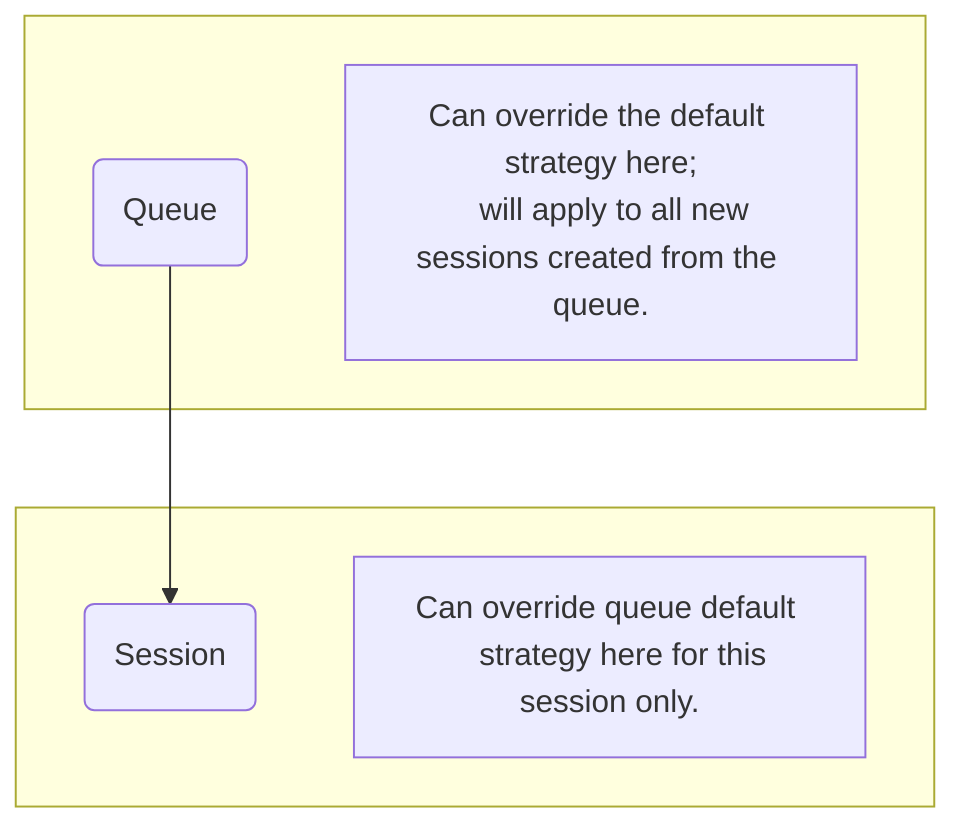

# ModernDiskQueue
[](https://www.nuget.org/packages/ModernDiskQueue)
[](https://github.com/pracsol/ModernDiskQueue/)

ModernDiskQueue (MDQ) is a fork of DiskQueue, a robust, thread-safe, and multi-process persistent queue. MDQ **adds first-class async support**, **dependency injection semantics**, and is built on the **latest .NET LTS runtime**.

MDQ is ideal for lightweight, resilient, First-In-First-Out (FIFO) storage of data using modern coding semantics.

## Major Feature History

| Version       | Changes                     |
|---------------| ----------------------------|
|**MDQ&nbsp;v4.***| Migrated to .NET 10 LTS.|
|**MDQ&nbsp;v3.***| Added built-in JSON serialization strategy; improved support for custom serialization strategies.|
|**MDQ&nbsp;v2.***| Added first-class async support and support for consumer DI containers. This version retains all the existing synchronous functionality, but the two APIs should not be invoked interchangeably.|
|**MDQ&nbsp;v1.*** | Upgraded the runtime to .NET 8, but otherwise functionally equivalent to the original DiskQueue synchronous library.|

**NuGet Package:** https://nuget.org/packages/ModernDiskQueue

**Source Repository:** https://github.com/pracsol/ModernDiskQueue

**Original DiskQueue project is at:** https://github.com/i-e-b/DiskQueue. MDQ was conceived as a drop-in
replacement for DiskQueue, but some minor breaking changes have been introduced in v2 onwards. See the section on [Migrating From DiskQueue](#migrating-from-diskqueue) below.

## Table of Contents
<!--TOC-->
  - [Installation](#installation)
  - [Requirements and Environment](#requirements-and-environment)
  - [Thanks to](#thanks-to)
  - [Quick Start](#quick-start)
    - [Register MDQ Factory in DI Container](#register-mdq-factory-in-di-container)
    - [Create a Queue, Enqueue and Dequeue Data](#create-a-queue-enqueue-and-dequeue-data)
  - [Basic Usage](#basic-usage)
    - [Asynchronous Operation (first supported in v2)](#asynchronous-operation-first-supported-in-v2)
    - [Dependency Injection Containers (first supported in v2)](#dependency-injection-containers-first-supported-in-v2)
    - [Original Synchronous Operation](#original-synchronous-operation)
  - [Serialization of Data](#serialization-of-data)
    - [Flexible Options](#flexible-options)
    - [Be Consistent](#be-consistent)
    - [Data Contracts and Options](#data-contracts-and-options)
      - [Customizing Options with the Built-In Serializers](#customizing-options-with-the-built-in-serializers)
    - [Examples for Setting Strategies](#examples-for-setting-strategies)
      - [Example of Specifying the Serialization Strategy at Queue Creation](#example-of-specifying-the-serialization-strategy-at-queue-creation)
      - [Example of Specifying the Serialization Strategy at Session Creation](#example-of-specifying-the-serialization-strategy-at-session-creation)
      - [Example of Setting Serialization Strategy Properties](#example-of-setting-serialization-strategy-properties)
    - [Implementing Custom Serialization Strategies](#implementing-custom-serialization-strategies)
      - [Example of a Custom Serialization Strategy](#example-of-a-custom-serialization-strategy)
      - [Why Would You Implement Your Own Serialization Strategy?](#why-would-you-implement-your-own-serialization-strategy)
  - [Transactions](#transactions)
    - [ACID](#acid)
    - [Managing Flushing of the Transaction Log](#managing-flushing-of-the-transaction-log)
    - [Handling Corruption](#handling-corruption)
  - [Global Default Configuration](#global-default-configuration)
    - [Async API](#async-api)
    - [Sync API](#sync-api)
  - [Logging](#logging)
    - [Async API](#async-api)
      - [ILogger Support](#ilogger-support)
    - [Sync API](#sync-api)
    - [What Gets Logged?](#what-gets-logged)
  - [Removing or Resetting Queues](#removing-or-resetting-queues)
    - [Async API](#async-api)
    - [Sync API](#sync-api)
  - [Data Security](#data-security)
    - [No Inherent Encryption](#no-inherent-encryption)
    - [Residual Data](#residual-data)
  - [Performance](#performance)
    - [Serializer Performance](#serializer-performance)
    - [Benchmarking of the Async vs Sync APIs](#benchmarking-of-the-async-vs-sync-apis)
      - [Benchmark Results](#benchmark-results)
      - [Interpretation](#interpretation)
      - [Guidance](#guidance)
      - [Conclusion](#conclusion)
    - [Contentious Access](#contentious-access)
  - [More Detailed Examples](#more-detailed-examples)
    - [Dependency Injection](#dependency-injection)
      - [Async Initialization in Hosted Startup Pattern](#async-initialization-in-hosted-startup-pattern)
      - [Discrete Queue Creation and Disposal](#discrete-queue-creation-and-disposal)
    - [Task-Based Workers](#task-based-workers)
  - [Guidance for Multi-Process and Multi-Thread Work](#guidance-for-multi-process-and-multi-thread-work)
    - [Multi-Process Work](#multi-process-work)
    - [Multi-Thread Work](#multi-thread-work)
  - [Advanced Topics](#advanced-topics)
    - [Inter-Thread and Cross-Process Locking](#inter-thread-and-cross-process-locking)
    - [Publishing With Trimmed Executables (Tree-Shaking)](#publishing-with-trimmed-executables-tree-shaking)
      - [Dependency Errors in Trimmed Applications](#dependency-errors-in-trimmed-applications)
      - [Serialization Issues in Trimmed Applications](#serialization-issues-in-trimmed-applications)
    - [Source Generation for Serialization](#source-generation-for-serialization)
  - [Migrating from DiskQueue](#migrating-from-diskqueue)
    - [Preserving Your Sync API Implementation](#preserving-your-sync-api-implementation)
    - [Implementing the Async API](#implementing-the-async-api)
  - [How To Build](#how-to-build)
    - [⚠️ First Build](#-first-build)
    - [🔧 Fix It!](#-fix-it)
<!--/TOC-->
## Installation
To install the package from NuGet, use the following command in the Package Manager Console:
```powershell
Install-Package ModernDiskQueue
```

ModernDiskQueue (MDQ) is written in C# on .NET 10.0.

## Requirements and Environment

- Requires access to the filesystem.
- Only partial support for trimmed deployments (tree-shaking) - see below.

The file system is used to hold cross-process locks, so any bug in your file system may cause
issues with MDQ -- although it tries to work around them.

## Thanks to

- Tom Halter https://github.com/thalter
- Niklas Rydén https://github.com/nikryden
- Stefan Dascalu https://github.com/stefandascalu64
- Iain Ballard https://github.com/i-e-b

## Quick Start
### Register MDQ Factory in DI Container
```csharp
services.AddModernDiskQueue();
```
### Create a Queue, Enqueue and Dequeue Data
Note: this is a functional example; please see the more detailed examples lower down for more practical implementation patterns.
```csharp
public class MyClass
{
	private readonly IPersistentQueueFactory _factory;

	public MyClass(IPersistentQueueFactory factory)
	{
		_factory = factory;
	}

	public async Task<byte[]> EnqueueAndDequeueMyData(byte[] data)
	{
        byte[] obj = [];
		await using (var queue = await _factory.WaitForAsync(QueuePath, TimeSpan.FromSeconds(5)))
		{
            // use 'await using' to ensure the queue is disposed of asynchronously.
			await using (var session = await queue.OpenSessionAsync())
			{
				await session.EnqueueAsync(data);
				// always commit the new enqueue with FlushAsync
				await session.FlushAsync();
			}

			await using (var session = await queue.OpenSessionAsync())
			{
				obj = await session.DequeueAsync();
				// always commit the dequeue transaction with FlushAsync
				await session.FlushAsync();
			}
		}
        return obj;
	}
}
```

## Basic Usage

### Asynchronous Operation (first supported in v2)
* `PersistentQueueFactory.WaitForAsync(..)` is the main entry point. This will attempt to gain an exclusive lock on the given storage location by calling `.CreateAsync(..)` until the specified timeout expires. `CreateAsync` gracefully fails if the queue is locked and contention is detected. On first use, a directory will be created with the required files inside of it.
* Typed queues are available with `PersistentQueueFactory.CreateAsync<T>(...)` or `PersistentQueueFactory.WaitForAsync<T>(...)`. This will create a strongly-typed queue that will handle the serialization and deserialization of elements in the queue. 
* This returned queue object can be shared amongst threads. Each thread should call `OpenSessionAsync()` to get its own session object.
* Generally speaking, ALWAYS wrap your `IPersistentQueue` and `IPersistentQueueSession` in an `await using()` block, or otherwise dispose of instances properly (e.g. by calling `DisposeAsync()`). Failure to do this will result in runtime errors or lock contention -- you will get errors that the queue is still in use. Be careful about using the simplified `await using` declarations introduced in C# 8.0 (no `{}`) when conducting multiple operations. Generally, you have more control over the scope of the object using the classic `await using [obj] {..}` statements.
> ⚠️DO NOT use the sync and async APIs interchangeably in the same queue lifecycle. The two implementations are not interchangeable and will cause deadlocks or other issues if you try to mix them. The lock awareness mechanisms under the hood are necessarily different for the sync and async APIs. Specifically, when using the async API, use the `PersistentQueueFactory` and its `.CreateAsync()` or `.WaitForAsync()` methods instead of the `PersistentQueue` constructors or the `IPersistentQueue.Create()` or `.WaitFor()` static methods. Every method has an Async API equivalent suffixed with *Async*.

### Dependency Injection Containers (first supported in v2)
* The `PersistentQueueFactory` can be registered with your DI container. This will allow you to inject the factory into your classes and use it to create queues. Use `services.AddModernDiskQueue()` to register the factory with the default settings.
* Your logging context will be passed to the factory, so you can use your DI container's logging framework to log messages from the queue.
* You can also use `services.AddModernDiskQueue(options => { ... })` to configure the factory with custom default settings. This overrides the GlobalDefaults static values implemented in the original synchronous API.

### Original Synchronous Operation
 - The original sync operations of DiskQueue have been preserved with very minor breaking changes related to custom serializer strategies from v2 onwards. All the implementation guidance for the original DiskQueue is still supported.
 - `PersistentQueue.WaitFor(...)` is the main entry point. This will attempt to gain an exclusive lock
   on the given storage location. On first use, a directory will be created with the required files
   inside it.
 - This queue object can be shared among threads. Each thread should call `OpenSession()` to get its 
   own session object.
 - Both `IPersistentQueue` and `IPersistentQueueSession` objects should be wrapped in `using()` clauses, or otherwise
   disposed of properly. Failure to do this will result in lock contention -- you will get errors that the queue
   is still in use.
 - There is also a generic-typed `PersistentQueue<T>(...);` which will handle the serialization and deserialization of elements in the queue. 
 Use `new PersistentQueue<T>(...)` in place of `new PersistentQueue(...)` or `PersistentQueue.WaitFor<T>(...)` in place of `PersistentQueue.WaitFor(...)` in any of 
 the examples below.
 - You can also assign your own `ISerializationStrategy<T>` 
to your `PersistentQueueSession<T>` if you wish to have more granular control over Serialization/Deserialization, or if you wish to 
use your own serializer (e.g System.Text.Json). This is done by assigning your implementation of `ISerializationStrategy<T>` to `IPersistentQueueSession<T>.SerializationStrategy`.
 - **NOTE:** Synchronous methods called on a queue instantiated through the `ModernDiskQueueFactory` will throw a runtime exception. A queue instance created by the `ModernDiskQueueFactory` should only use methods whose names are suffixed with *Async*.

## Serialization of Data
### Flexible Options
MDQ provides flexible options for serializing data. You can use any of the following approaches:
* **Blind Bytes** - The **non-generic** queue `IPersistentQueue` will accept any byte array for storage. It's up to you to create this
byte array, and the queue doesn't care what it represents - it could be binary data like an image file or a complex data structure you serialized yourself (out-of-band serialization). 

* **Built-In XML Serializer (Default)** - The generic queue `IPersistentQueue<T>` will use this serializer by default, based on `System.Runtime.Serialization.DataContractSerializer`. 
This is a reflection-based XML serializer. It offers the advantage of storing your data in human-readable format, but is verbose. It is retained as the default for backward compatibility but new projects may
prefer to use the JSON serializer.

* **Built-In JSON Serializer (v3+)** - The generic queue can optionally use `System.Text.Json` to serialize and deserialize objects. It is also reflection-based and will store data
in a human-readable format. It represents a >50% reduction in size on disk compared to the XML serializer.

* **BYOS (Bring Your Own Serializer)** - You can specify your own `ISerializationStrategy<T>` for several advantages - you may find it a more elegant/readable way to encapsulate your own serialization compared
to the 'blind bytes' approach; it is ideal for implementing source-generated serialization rather than using reflection-based serialization; custom serializers can be used to natively store your data in MessagePack, protoBuf, or any other format you choose.

> ℹ️ The built-in XML Serializer, using `DataContractSerializer`, does not support source-generated serialization. For this reason, amongst others, new projects may prefer the built-in JSON serializer, which does support source-generated serialization.

### Be Consistent
Obviously you need to use the same strategy when serializing and deserializing data. You cannot serialize
data as JSON and then deserialize it using the XML serializer.


### Data Contracts and Options

Remember that the built-in XML and JSON serializers have different default behaviors inherent 
to the .NET libraries they use. For example, the default handling of **dynamic types** and **private fields** differs between the 
two strategies. The behavior of the serializers can be manipulated with the myriad approaches supported by the 
built-in libraries, typically by adding the appropriate attributes to your class definitions.

The built-in serializers do not require any attribute annotation of your classes unless you are unhappy with
the results of the default behavior. You may want to use attribute annotation to control inclusion, manage naming, serialize private fields, or add version-control to explicit behavior directives. 

> ℹ️ The original DiskQueue library had advised annotating your classes with the `[Serializable]` attribute, but this was a requirement of the deprecated `BinaryFormatter` library and is
not required by the built-in serializers provided by MDQ. `BinaryFormatter` was killed off in .NET 9 as the final stage in their long-term obsoletion plan.

> ℹ️ Be mindful of breaking changes that have taken place between .NET 8 and .NET 10. These have affected default contract behaviors and validation. https://learn.microsoft.com/en-us/dotnet/core/compatibility/serialization/10/property-name-validation


#### Customizing Options with the Built-In Serializers
Specifying the `SerializationStrategy.Json` value when creating a typed queue will use the built-in JSON serializer with **default options**. You can specify your own `JsonSerializerOptions` to customize the serialization behavior. This is done by instantiating the built-in `SerializationStrategyJson<T>` class with the desired options first, and then passing this strategy object into the `CreateAsync<T>` or `WaitForAsync<T>` methods of `IPersistentQueueFactory`. This allows you to 
specify `PropertyNamingPolicy`, `DefaultIgnoreCondition`, `MaxDepth` and many other options.. 

> ℹ️ **Important**: you can use this feature to specify a `TypeInfoResolver` as a way to support source generation 
and versioned data contracts without having to create your own implementation of `ISerializationStrategy<T>`. For more information on this and an example, please see the [**Advanced Topics**](#advanced-topics) section below.

Example of specifying the JSON options when creating a typed queue:
```csharp
var myStrategyOptions = new SerializationStrategyJson<MyClass>(new JsonSerializerOptions
{
    PropertyNamingPolicy = JsonNamingPolicy.CamelCase,
    DefaultIgnoreCondition = JsonIgnoreCondition.WhenWritingNull,
    MaxDepth = 10
});
var q = await _factory.CreateAsync<MyClass>(QueueName, myStrategyOptions);
```

A similar approach can be used to specify the `DataContractSerializerSettings` with `SerializationStrategyXml<T>` if you are using the XML serializer. Note, however, that there is currently no support for source-generation with `System.Runtime.Serialization.DataContractSerializer`.

### Examples for Setting Strategies
For in-band serialization on typed queues, the default serializer is `System.Runtime.Serialization.DataContractSerializer`. You have a lot of flexibility to override the default at different points in the queue lifecycle.


#### Example of Specifying the Serialization Strategy at Queue Creation
```csharp
// Use the enum SerializationStrategy to specify one of the built-in strategies.
var queue = await _factory.CreateAsync<MyClass>(QueueName, SerializationStrategy.Json);

// Provide your own implementation or an included implementation of ISerializationStrategy<T> when instantiating the queue.
var queue = await _factory.CreateAsync<MyClass>(QueueName, new SerializationStrategyJson<MyClass>());

// NOTE: the two above examples are equivalent. The first one is just a shorthand for the second one.
// BE AWARE: all sessions created from the queue object will use its default strategy by default!
```

#### Example of Specifying the Serialization Strategy at Session Creation
```csharp
// When no strategy is provided at queue creation, the default strategy is used.
var queue = await _factory.CreateAsync<MyClass>(QueueName);

// You can use the SerializationStrategy enum to override the queue default strategy.
await using var session = await queue.OpenSessionAsync(SerializationStrategy.Json);

// You can specify an implementation of ISerializationStrategy<T> to override the queue default.
await using var session = await queue.OpenSessionAsync(new SerializationStrategyJson<MyClass>());

// NOTE: the two above examples of specifying the session strategy are equivalent. The first one is just a shorthand for the second one.
// BE AWARE: the session strategy will override the queue default strategy for this session only.
```

#### Example of Setting Serialization Strategy Properties
```csharp
// Both at the queue level and the session level, defaults can be overridden by 
// setting the serialization strategy explicitly.

// For the queue
queue.DefaultSerializationStrategy = new SerializationStrategyJson<MyClass>();

// For the session
session.SerializationStrategy = new SerializationStrategyXml<MyClass>();
```

### Implementing Custom Serialization Strategies
As mentioned earlier, if you want to handle your own serialization you can do it with your own service
generating byte arrays passed to `IPersistentQueue` (**out-of-band serialization**), or you can create an implementation of 
`ISerializationStrategy<T>` to use with the strongly-typed `IPersistentQueue<T>` queues (**in-band serialization**).

Implementing `ISerializationStrategy<T>` requires the implementation of the following methods: 
* `Serialize`
* `SerializeAsync`
* `Deserialize`
* `DeserializeAsync`. 
 
Optionally, you can inherit from either of two base classes that will cut this implementation work in half:
* `AsyncSerializationStrategyBase` - only required to implement the async methods.
* `SyncSerializationStrategyBase` - only required to implement the sync methods.

`AsyncSerializationStrategyBase` contains abstract definitions for the async methods, with virtual
methods to satisfy the sync definitions. Those sync methods just invoke the your async methods. 
`SyncSerializationBase` contains the opposite. These base classes let you implement `ISerializationStrategy<T>`
without having to override all four methods. This should reduce developer friction if you know you're 
focusing on one idiom or the other.

#### Example of a Custom Serialization Strategy
This is a very basic example of a custom serialization strategy using MessagePack. 
It implements the `ISerializationStrategy<T>` interface and uses the third-party MessagePack library to 
serialize and deserialize objects of type `T`. The `SerializeAsync` method converts the 
object to a byte array, while the `DeserializeAsync` method converts the byte array back to an 
object of type `T`.

In this example, we are inheriting `AsyncSerializationStrategyBase<T>`, so we only need to override 
the async methods. The sync methods are implemented for us. If you want to implement all the methods yourself, you
can just inherit `ISerializationStrategy<T>` directly.

```csharp
    using System.Threading.Tasks;
    using MessagePack;

    /// <summary>
    /// Implements <see cref="ISerializationStrategy{T}"/> using MessagePack for serialization and deserialization.
    /// </summary>
    /// <typeparam name="T">Type of object that will be (de)serialized.</typeparam>
    public class SerializationStrategyMsgPack<T> : AsyncSerializationStrategyBase<T>
    {
        /// <inheritdoc/>
        public async override ValueTask<byte[]?> SerializeAsync(T? obj, CancellationToken cancellationToken = default)
        {
            ArgumentNullException.ThrowIfNull(obj);
            using MemoryStream ms = new();
            await MessagePackSerializer.SerializeAsync<T>(ms, obj, null, cancellationToken);
            return ms.ToArray();
        }

        /// <inheritdoc/>
        public async override ValueTask<T?> DeserializeAsync(byte[]? data, CancellationToken cancellationToken = default)
        {
            if (data == null)
            {
                return default;
            }
            using MemoryStream ms = new(data);
            return await MessagePackSerializer.DeserializeAsync<T>(ms, null, cancellationToken);
        }
    }
```

For more examples of implementing `ISerializationStrategy<T>`, please review the `SerializationStrategyJson` and `SerializationStrategyXml` classes in the source code. These are the built-in serializers of MDQ described earlier.

#### Why Would You Implement Your Own Serialization Strategy?
**Driven by Requirements:**
* If you are already annotating your class definitions with data contract information specific to a serializer (e.g. MessagePack), you can leverage that metadata by implementing an `ISerializationStrategy<T>`. This not only saves time and keeps your class definitions cleaner, but it also provides consistent serialization behavior across your codebase.
* If you are implementing source-generated serialization, you can use the `ISerializationStrategy<T>` interface to facilitate this. However, if using JSON, note that the built-in JSON serializer does allow for source-generated serialization without needing to implement your own strategy (see more under **Advanced Topics** below).
* If you need data encrypted at rest, `ISerializationStrategy<T>` could be used to implement your own serialization 
logic that encapulates calls to your encryption service before serializing it and decrypts it on the way back out, making encrypt/decrypt operations
inherent to your queue interactions (see [**Data Security**](#data-security) section below).

**Driven by Design:**

Let's compare the use of `ISerializationStrategy<T>` to the following scenario: you implement a serialization service that converts your complex object data into a byte array outside of MDQ, and you pass that byte array directly to a `IPersistentQueue` for storage.

This approach may be appropriate if:

* You need to store **multiple object types** in a single storage queue, and

* You have a reliable way to **determine the object type after dequeue ops and deserialize accordingly**.

However, if you're only storing a single complex object type per queue, it may be more elegant to encapsulate your serialization logic within an `ISerializationStrategy`. This allows you to pass an object directly to MDQ, without making explicit calls to an intermediate (de)serialization service.

In short, the `ISerializationStrategy<T>` interface provides a clean way to encapsulate custom serialization logic, calls to encryption services, and anything else you want to be 
'automatic' when interacting with the queue rather than depending on discrete calls to external services.

## Transactions

### ACID
Each session is a transaction. Any enqueues or dequeues will be rolled back when the session is disposed unless
you call `session.FlushAsync()`. Data will only be visible between threads once it has been flushed (similar to a database commit). The locking strategies described below under the [**Advanced Topics**](#advanced-topics) section keep transactions isolated.

### Managing Flushing of the Transaction Log
You have flexibility to control the safety of the transaction log. Each flush incurs a performance penalty due to disk IO and fsync. By default, each transaction is persisted to disk before continuing. You 
can get more speed at a safety cost by setting `queue.ParanoidFlushing = false;`. Additionally, the transaction log will get cleaned up of unnecessary operations (e.g. dequeued items) each time the queue itself is disposed if `TrimTransactionLogOnDispose` is set to `true`. This is the default behavior. Because the trimming of the transaction log involves disk IO, there is a performance penalty each time this operation happens.
Each instance of a `PersistentQueue` has its own settings for flush levels and corruption behavior. You can set these individually after creating an instance, or globally (see **Global Default Configuration** below).

For example, if performance is more important than crash safety (default):
```csharp
IPersistentQueue.ParanoidFlushing = false;
IPersistentQueue.TrimTransactionLogOnDispose = false;
```

Or if up-time is more important than detecting corruption early (often the case for embedded systems):
```csharp
IPersistentQueue.ParanoidFlushing = true;
IPersistentQueue.TrimTransactionLogOnDispose = true;
```

### Handling Corruption
By default, ModernDiskQueue will silently discard transaction blocks that have been truncated; it will throw an `InvalidOperationException`
when transaction block markers are overwritten (this happens if more than one process is using the queue by mistake. It can also happen with some kinds of disk corruption).
If you construct your queue with `throwOnConflict: false`, all recoverable transaction errors will be silently truncated. 

```csharp
await using (var queue = await _factory.WaitForAsync(path, throwOnConflict: false))
{
    . . .
}
```

Similarly, the value `IPersistentQueue.AllowTruncatedEntries` affects how the library behaves when it encounters incomplete data entries. If set to `false`, an exception will be thrown when a truncated entry is found. This is the default behavior. If set to `true`, the library will skip over truncated entries and continue processing.

By default, the queues are set up to prioritize data integrity over performance.

## Global Default Configuration

### Async API
In the async api, the global defaults are specified using the Options pattern using the `ModernDiskQueueOptions` class, provided when configuring services. 

> ℹ️ As stated earlier, the default settings favor safety over performance.

Example from appsettings.json or other configuration store outside of compiled code:
```json
{
  "ModernDiskQueue": {
    "ParanoidFlushing": false,
    "TrimTransactionLogOnDispose": true,
    "AllowTruncatedEntries": false,
    "SetFilePermissions": true,
    "FileTimeoutMilliseconds": 5000,
    "ThrowOnConflict": false
  }
}
```
Then in program.cs, for example, we'd reference that configuration, which will be used by the factory.
```csharp
services.Configure<ModernDiskQueueOptions>(
    configuration.GetSection("ModernDiskQueue"));

// Register ModernDiskQueue services (factory uses DI to get the Options)
services.AddModernDiskQueue();
```
The options pattern is highly flexible both in terms of where, how, and how often it gets its data.

An alternative programmatic configuration is shown below, which would allow computed or dynamic values.
```csharp
services.AddModernDiskQueue(options =>
{
    options.ParanoidFlushing = hostEnvironment.IsProduction();
    options.TrimTransactionLogOnDispose = true;
});
```

Support for `IOptionsMonitor` has not been implemented since consumers can already override settings on a per-queue-instance basis.

Specifically, each instance of a queue created using the `IPersistentQueueFactory.CreateAsync()` or `IPersistentQueueFactory.WaitForAsync()` methods can have these Options values set directly on a per-instance basis, which will override the global defaults if you need to affect a specific queue's behavior at runtime. 

> ℹ️ This behaves differently than the sync API -- the async API does not envision the *global defaults* being changed at runtime. Rather, it is expected that one would change the settings on a queue instance at runtime as needed.

### Sync API

Global default settings can be set using the `PersistentQueue.DefaultSettings` static class.

Default settings are applied to all queue instances *in the same process* created only *after* the setting is changed. The SetFilePermissions value behaves differently in that changes *will* affect behavior for existing queue instances.

This behavior has not changed from the legacy library.
```csharp
// Example of setting global defaults for the sync API.
PersistentQueue.DefaultSettings.ParanoidFlushing = true;
```

## Logging

### Async API
All logging is performed using the logging context you configure in your DI container. 

#### ILogger Support
The async API uses the `Microsoft.Extensions.Logging.ILogger` interface to log messages. This allows you to use any logging framework that supports `ILogger`, including **Serilog** and **NLog**. The logging context is automatically passed to the MDQ factory when you register it with your DI container.


### Sync API

Some internal warnings and non-critical errors are logged through `PersistentQueue.Log`.
This defaults to stdout, i.e. `System.Console.WriteLine`, but can be replaced with any `Action<string>`. This behavior has not changed from the legacy library.

### What Gets Logged?
Logging can be an expensive operation so at present the logging has been kept to a minimum. The async API does log more data than the sync API, but any points in the legacy sync API that were logged have been retained in the async API.

| Log Level    | Events |
| -------- | ------- |
| Error | Factory queue creation errors.<br/>Queue session dequeue errors.* <br/>Critical errors when locking or unlocking queue.* <br/>Errors during hard delete.<br/>Path or permission errors.<br/>Errors accessing the transaction log.*
| Warning | Errors generated when accessing meta state.* |
| Information  | Queue creation.    |
| Trace/Verbose |  Queue hard delete start and finish.<br/>Session enqueue and dequeue events.<br/>Cross-process lock file creation attempt, failure and success.<br/>Cross-process lock file release.<br/>Queue disposal.<br/>Factory queue access retries (when locked).<br/>Non-critical errors when locking or unlocking queue.|

\* Only these events get logged by sync API.

## Removing or Resetting Queues

Queues create a directory and set of files for storage. You can remove all files for a queue with the `HardDeleteAsync` method.
If you give `true` as the reset parameter, the directory will be written again without any of the files.

> ⚠️ WARNING: This WILL delete ANY AND ALL files inside the queue directory. If you create a queue in a folder shared by other data, it will
delete the entire contents therein, beyond just the queue files. It would be unusual to call this method in normal use as the whole 
point of a persistent queue is for the data to persist.

### Async API
```csharp
await using (var queue = await _factory.CreateAsync(QueuePath))
{
    await queue.HardDeleteAsync(false);
}
```

### Sync API
```csharp
var subject = new PersistentQueue("queue_a");
subject.HardDelete(true); // wipe any existing data and recreate containing folder.
```

⚠️ NOTE: there is a bug in the legacy sync API that happens when `PersistentQueue.DefaultSettings.TrimTransactionLogOnDispose` is set to `true`. The `HardDelete` method successfully removes files and folder, but when the queue object is disposed, a new transaction.log file is written, recreating the folder and transaction file. This will be corrected in a future release, but care has been taken to preserve original sync API in all respects for now.

## Data Security
### No Inherent Encryption
This library does *not* perform any data encryption. Data is stored on disk exactly as you deliver it. 
If you need data to be encrypted at rest, you should encrypt it via your own process and pass the encrypted bytes to be enqueued. 
Possible approaches to this are to use an intermediate process to encrypt the data and pass the byte array to the `IPersistentQueue` (out-of-band), 
or implement your own `ISerializationStrategy<T>` that encapsulates the call to such an encryption service after serializing it and decrypts data on the way back out (in-band). This 
latter approach makes encrypt/decrypt operations inherent to your queue interactions.

### Residual Data
Data that has been enqueued is stored on disk in a data file. That indexed data is not removed when it is dequeued. There are performance advantages to this design approach, but it is important to understand the trade-off. If you enqueue sensitive data (e.g. PII), be aware that it will remain on disk until the data file rolls over or `HardDeleteAsync` is invoked to clean up the queue. For this and other reasons, you should probably encrypt sensitive data prior to enqueuing it if you do not have complete control of the host system and appropriate mitigating controls (whole disk encryption, access control, etc).

## Performance
### Serializer Performance

In the project `ModernDiskQueue.Benchmarks` the `SerializerStrategies` benchmark attempts to track the performance impact of using different serialization strategies. It does this by enqueuing and dequeuing a bunch of objects and examining the size of the data file produced and the completion speed.

As expected, the JSON serializer has a much smaller footprint on disk than XML. Sample results are shown in the table below. Also included for comparison is a custom `ISerializationStrategy<T>` using [MessagePack-CSharp](https://github.com/MessagePack-CSharp/MessagePack-CSharp),
which represents another level of disk space savings.

| Strategy Name        | Iteration Count| Average File Size* |
|----------------------|----------------|--------------------|
| JSON (built-in)      | 20             | 3,126              |
| XML (built-in)       | 20             | 7,129              |
| MessagePack (custom) | 20             | 1,711              |

\* This test was run enqueueing the same 20 objects created with the `SampleDataFactory` class in `ModernDiskQueue.Benchmarks.SampleData`. Actual file size depends on what you're enqueuing.

Speed is harder to evaluate using this benchmark unless you measure a lot of iterations to smooth the outliers. 
The benchmark is not well-designed for testing the serialization library performance specifically, only how the libraries are performing under MDQ's particular workloads. Generally, the differences in (de)serialization speed seem statistically irrelevant in the context of MDQ - your disk is probably your biggest bottleneck.


### Benchmarking of the Async vs Sync APIs
In the `benchmarks` project, the `ThreadsAndTasks` class compares three different approaches to enqueuing and dequeuing 100 objects concurrently. These include the use of the sync API with dedicated threads, the use of the async API with dedicated threads, and the use of the async API with tasks. While implementation is necessarily different, the spirit of the work and how it's performed has been as closely matched as possible. The results are as follows:

#### Benchmark Results
```Shell
Job=BenchmarkConfigThreadTaskComparison  InvocationCount=1  IterationCount=20
LaunchCount=2  UnrollFactor=1  WarmupCount=2
```
| Method                                     | Mean    | Error    | StdDev  | Median  | Gen0      | Completed Work Items | Lock Contentions | Gen1      | Allocated |
|------------------------------------------- |--------:|---------:|--------:|--------:|----------:|---------------------:|-----------------:|----------:|----------:|
| SyncEnqueueDequeueConcurrentlyWithThreads  | 9.125 s | 0.7740 s | 1.293 s | 9.819 s | 4000.0000 |             300.0000 |         176.0000 | 1000.0000 |  34.09 MB |
| AsyncEnqueueDequeueConcurrentlyWithThreads | 9.350 s | 2.1251 s | 3.492 s | 7.915 s | 6000.0000 |            3554.0000 |                - | 2000.0000 |  50.11 MB |
| AsyncEnqueueDequeueConcurrentlyWithTasks   | 9.350 s | 2.0702 s | 3.459 s | 7.909 s | 6000.0000 |            3563.0000 |                - | 2000.0000 |  50.23 MB |

#### Interpretation
The async API brings some extra overhead inherent to the asynchronous context switching, most clearly evident in the memory allocation and work items, but for all intents and purposes the APIs demonstrate equivalent throughput when doing the same body of work in similar implementations. 

Mean task completion times between the two are close, the differences not being statistically significant. Async medians are lower than their mean, indicating that outliers are driving up the mean. The sync API has a much lower standard deviation, reflecting the control inherent in its synchronous execution. The async API is more susceptible to "weather" in the shared thread pool. This is not unexpected, as the async/await infrastructure is designed to be more responsive to the environment in which it is running.

Tight loops of enqueueing and dequeueing may be rare in real-world implementations, but these high stress scenarios describe performance limits for a given hardware configuration and give confidence that the async API has not sacrificed too much in terms of supported operations per second.

#### Guidance
The work on unit tests and benchmarks consistently demonstrated that implementation patterns play an incredibly important role in async API performance, with small adjustments in consumer loop design having a profound impact - sometimes by an order of magnitude. If your tolerances are tight and demands high, you will want to carefully tune your loops to avoid "thundering herd" or starvation issues by introducing random or fixed jitter into each iteration. As well, increasing timeouts waiting for queues will make concurrently running processes more tolerant of lock contention. 

Please read the [Multi-Process and Multi-Thread Work](#guidance-for-multi-process-and-multi-thread-work) section for additional guidance.

Please see the [examples](#More-detailed-examples) section below for some ideas on implementation. The unit tests and other benchmarks may provide additional ideas.

#### Conclusion
Generally speaking, the async API should perform just as well as the sync API while providing the semantics of asynchronous programming and other benefits as described earlier. As well, the async API may offer better scalability due to more efficient thread usage, though clearly memory utilization is higher. Again, actual performance will vary depending on workload and system configuration

### Contentious Access
Please see the section [**Guidance for Multi-Process and Multi-Thread Work**](#guidance-for-multi-process-and-multi-thread-work) for some insights into maximizing performance when high contention is anticipated.

## More Detailed Examples

### Dependency Injection
For the async support, a simple factory pattern was implemented as the vehicle to create queue objects. This was done to perform internal async initialization tasks which couldn't be done inside constructors; it will also facilitate feature development down the road.

A registration helper was built to allow the factory to be registered with your DI container. This is done by calling `services.AddModernDiskQueue()` in your `ConfigureServices` method. By doing this, your logging context will be used by the library.

There is presently no support for registering individual queues in the DI container. Instead, it is contemplated that queues will be created via async initialization in a hosted startup pattern (like a `BackgroundService` or any `IHostedService`). Alternatively, queues may be created and disposed for discrete operations if multiprocess usage of the same storage queue is a design requirement.

#### Async Initialization in Hosted Startup Pattern
This is a conceptual example of how to use the factory in a hosted service. It assumes that the storage queue will be created on service startup and disposed when the service is shut down - that is to say, the service will be using the queue exclusively and will not be worried about other processes needing access.

This simple example performs eager initialization in the service class using a nullable field, but you can implement with a lazy task or other approaches.

Service configuration:
```csharp
services.AddLogging(builder =>
{
    builder.SetMinimumLevel(LogLevel.Trace);
    builder.AddConsole();
});

services.AddModernDiskQueue();
```

Application infrastructure service implementing MDQ:
```csharp
public class LocalStorageService 
{
	private readonly IPersistentQueueFactory _factory;
	private IPersistentQueue? myQueue;
	
	public LocalStorageService(IPersistentQueueFactory factory)
	{
		_factory = factory;
	}

	public async InitializeService()
	{
		myQueue = await _factory.WaitForAsync("myStoragePath", TimeSpan.FromSeconds(5));
	}
	// Methods for getting and putting objects into queue.
	[...]
}
```

Application hosted service:
```csharp
protected override async Task ExecuteAsync(CancellationToken stoppingToken)
{
	await _localStorageService.InitializeService();
	// now do work
	[...]
}
```

#### Discrete Queue Creation and Disposal
This is an example of a service that creates and disposes of a queue for each operation. This is useful if you are using the same storage location across multiple processes, or if you want to ensure that the lock on the queue is dropped as soon as possible. It is far less performant but is more friendly to cross-process access to the same storage queue. Note the use of `await using` blocks to ensure that the queue is disposed of properly, and as soon as we're done with it.

```csharp
public class MyService
{
	private readonly IPersistentQueueFactory _factory;
	public MyService(IPersistentQueueFactory factory)
	{
		_factory = factory;
	}
	public async Task DoWork()
	{
		await using (var queue = await _factory.WaitForAsync("myStoragePath", TimeSpan.FromSeconds(5)))
		{
			await using (var session = await queue.OpenSessionAsync())
			{
				var data = await session.DequeueAsync();
				if (data != null)
				{
                    // process data
					await session.FlushAsync(); // "commit" the dequeue
				}
			}
		}
	}
}
```

### Task-Based Workers
The `ThreadsAndTasks.AsyncEnqueueDequeueConcurrentlyWithTasks()` method in the `ModernDiskQueue.Benchmarks` project provides a decent example of how one might implement a producer/consumer pattern using the async API. This example uses a `TaskCompletionSource` to signal when the producer and consumer tasks have completed, and uses `Interlocked` to safely increment the enqueue and dequeue counts across multiple threads. The example also includes a timeout for the tasks to complete, which was useful for debugging and testing purposes.

```Csharp
public async Task AsyncEnqueueDequeueConcurrentlyWithTasks()
{
    const int TargetObjectCount = CountOfObjectsToEnqueue;
    Exception? producerException = null;
    Exception? consumerException = null;

    int enqueueCount = 0;
    int dequeueCount = 0;
    var enqueueCompletionSource = new TaskCompletionSource<bool>();
    var dequeueCompletionSource = new TaskCompletionSource<bool>();

    IPersistentQueue q = await _factory.CreateAsync(QueuePathForAsyncTasks);

    // Producer task
    var producerTask = Task.Run(async () =>
    {
        try
        {
            var rnd = new Random();
            for (int i = 0; i < TargetObjectCount; i++)
            {
                await using (var session = await q.OpenSessionAsync())
                {
                    await session.EnqueueAsync(new byte[] { 1, 2, 3, 4 });
                    Interlocked.Increment(ref enqueueCount);
                    await Task.Delay(rnd.Next(0, 100));
                    await session.FlushAsync();
                }
            }
            enqueueCompletionSource.SetResult(true);
        }
        catch (Exception ex)
        {
            producerException = ex;
            enqueueCompletionSource.SetException(ex);
        }
    });

    // Consumer task
    var consumerTask = Task.Run(async () =>
    {
        try
        {
            var rnd = new Random();
            do
            {
                await using (var session = await q.OpenSessionAsync())
                {
                    var obj = await session.DequeueAsync();
                    if (obj != null)
                    {
                        Interlocked.Increment(ref dequeueCount);
                        await session.FlushAsync();
                    }
                    else
                    {
                        //Console.WriteLine("got nothing, I'm starved for objects so backing off..");
                        await Task.Delay(rnd.Next(0, 100)); // Wait a bit if nothing to dequeue
                    }
                }
            }
            while (dequeueCount < TargetObjectCount);
            dequeueCompletionSource.SetResult(true);
        }
        catch (Exception ex)
        {
            consumerException = ex;
            dequeueCompletionSource.SetException(ex);
        }
    });

    // Wait for both tasks with timeout
    var completionTasks = new[]
    {
        enqueueCompletionSource.Task.WaitAsync(TimeSpan.FromMinutes(2)),
        dequeueCompletionSource.Task.WaitAsync(TimeSpan.FromMinutes(2))
    };

    try
    {
        await Task.WhenAll(completionTasks);
    }
    catch (TimeoutException)
    {
        if (!enqueueCompletionSource.Task.IsCompleted)
            Console.WriteLine("Producer task timed out.");
        if (!dequeueCompletionSource.Task.IsCompleted)
            Console.WriteLine("Consumer task timed out.");
    }

    await q.DisposeAsync();
}
```

## Guidance for Multi-Process and Multi-Thread Work
Some of the examples in the original DiskQueue library showing how to create a thread to enqueue and a thread to dequeue have been left out of this README. The implementation of such a pattern is a bit outside the scope of this library, particularly as it concerns the async API. But some thoughts follow.

### Multi-Process Work
This scenario is likely to arise from two discrete applications attempting to access the same storage queue. As described above, the guidance for this scenario is to instantiate and dispose of the queue as quickly as possible so the multi-process file lock is not held for any longer than needed. For more information on this, see the locking section under [**Advanced Topics**](#advanced-topics).

### Multi-Thread Work
This scenario is likely to arise from a single application with multiple threads trying to access the same storage queue. This may come from tasks running on the shared thread pool (following common async patterns) or through the creation of dedicated threads to do the work (more common with the synchronous API). The guidance for this scenario is to create a long-lived queue object outside of the task or thread-based workloads, creating and disposing of sessions as needed. This will allow the threads to share the queue object and avoid contention and performance penalties associated with the cross-process file locking mechanism.

If you create the queue instances within each thread, you will be employing the multi-process lock mechanism unnecessarily, which will slow down queue performance. In fact, this is how we simulate multi-process contention in the unit tests.

Your design decisions can greatly affect performance. **Library consumers are advised to leverage Task-based asynchronous programming patterns rather than building dedicated threads when using the async API**. If a dedicated thread is created to handle, for example, all the dequeue operations while the main call stack works on enqueuing objects, be sure to follow best practices for executing asynchronous operations inside a thread. It's **very easy** to do this incorrectly, creating deadlocks, executing blocking synchronous units of work, or creating a thread that does nothing more than throw the body of work back on the shared thread pool, with no thread affinity, which may not yield the results you're after.
## Advanced Topics
### Inter-Thread and Cross-Process Locking

Internally, thread safety is accomplished with standard lock awareness patterns, but these don't guard against contention between different processes trying to access the same storage location.

To solve this, the queue uses a lock file to indicate that the queue is in use. This file is created with the name 'lock' in the queue directory. It is only written on queue creation, not during session creation. It contains the process ID, the creating thread ID, and a timestamp. The lock file is deleted when the queue is properly disposed.

These implementation details are why activities performed only across multiple *threads* should avoid recreating the queue each time they have work to do; instead they should simply create and dispose of *sessions* on a long-lived queue object created by the parent process. Doing otherwise will cause your threads to be using the slower locking mechanism meant for cross-process access when it is not necessary.

However, if it's anticipated that multiple processes will be using the same storage location, you'll want the lock file to be very short lived, and this will mean disposing of the queue itself as soon as you can.

The factory method `WaitForAsync` will accommodate multi-process access by attempting to obtain a lock on the queue until the specified timeout has been reached. If each process uses the lock for a short time and waits long enough, they can share a storage location.

This approach works relatively well, but can show its limits when extreme contention is anticipated (many processes conducting many operations each, concurrently). The cross-platform compatibility goal of this library design precludes use of OS-specific mutexes which would likely offer more performance and reliability. That said, even with cross-process use of the queue, sub-second enqueuing and dequeuing is certainly achievable. There are performance tests in the benchmarks project that you can use to determine whether your needs can be met.

### Publishing With Trimmed Executables (Tree-Shaking)

When publishing your consuming application with trimming enabled, you'll encounter two problems: (de)serialization issues and dependency errors. 

#### Dependency Errors in Trimmed Applications
Expect to see errors like this when publishing with trimming is enabled:
```shell
Unhandled exception. 
System.IO.FileNotFoundException: Could not load file or assembly 'Microsoft.Extensions.Logging
```

Even though the MDQ library has implemented some steps to prevent dependencies from being trimmed, such as using attributes like `DynamicDependency`, these do not propagate preservation requirements to consuming applications.

Therefore, tree-shaking does require some cooperation between libraries and their consumers. Specifically, your application should include explicit references to the libraries MDQ needs if not already doing so for your own needs. Adding the following lines to your project file should avoid these problems:

```xml
    <TrimmerRootAssembly Include="Microsoft.Extensions.Logging" Version="10.0.1" />
    <TrimmerRootAssembly Include="Microsoft.Extensions.Logging.Abstractions" Version="10.0.1" />
    <TrimmerRootAssembly Include="Microsoft.Extensions.DependencyInjection" Version="10.0.1" />
    <TrimmerRootAssembly Include="Microsoft.Extensions.DependencyInjection.Abstractions" Version="10.0.1" />
    <TrimmerRootAssembly Include="Microsoft.Extensions.Options" Version="10.0.1" />
```

#### Serialization Issues in Trimmed Applications

Starting in .NET 8, reflection-based serialization is disabled by default when a project is
compiled with the `<PublishTrimmed>` attribute set to `true`. 

The default serialization strategy in this library, as in the legacy DiskQueue, is `System.Runtime.Serialization.DataContractSerializer`. The .NET 8 framework and above uses type adapters that get lost in the trimming process. Getting an error like `No set method for property 'OffsetMinutes' in type 'System.Runtime.Serialization.DateTimeOffsetAdapter'`, even though there most certainly is an internal setter for this property, is a symptom of the tree-shaking.

As a consequence, you are better off using source-generated serialization for JSON
rather than reflection-based serialization on either built-in serializer. The good news is:
* It's easy.
* It's far more performant than reflection.

For more info, please see
- https://learn.microsoft.com/en-us/dotnet/core/deploying/trimming/incompatibilities#reflection-based-serializers
- https://learn.microsoft.com/en-us/dotnet/core/compatibility/serialization/8.0/publishtrimmed
- https://learn.microsoft.com/en-us/dotnet/standard/serialization/system-text-json/source-generation
- https://github.com/i-e-b/DiskQueue/issues/35


### Source Generation for Serialization

Source generation is not an option for `DataContractSerializer`, but it is for `System.Text.Json`. The built-in JSON serializer in MDQ can be configured to use source generation without implementing your own `ISerializationStrategy<T>`.

What follows is a very basic conceptual example of implementing source generation. You can see a working example in the unit test `SerializationStrategyJsonTests.StrategyJson_SerializeUnsupportedTypeWithSourceGeneration_SerializationSucceeds`. 

First, create a partial class inheriting from `JsonSerializerContext` and use attributes to include your custom class.


```csharp
internal class MyCustomClass
{
    public Guid Id { get; set; }
    public DateTimeOffset LastUpdated { get; set; }
}

[JsonSourceGenerationOptions(GenerationMode = JsonSourceGenerationMode.Metadata)]
[JsonSerializable(typeof(MyCustomClass))]
internal partial class MySourceGenerationContext : JsonSerializerContext;
```

Then, with MDQ's `SerializationStrategyJson`, you can pass in an instance of `JsonSerializerOptions` with the `TypeInfoResolver` set to your custom context. This will allow you to use source generation for serialization and deserialization.

```csharp
var options = new JsonSerializerOptions
{
    TypeInfoResolver = MySourceGenerationContext.Default
};

var jsonStrategy = new SerializationStrategyJson<MyCustomClass>(options);

await using var queue = await _factory.CreateAsync<TestClassSlim>(MyQueueName, jsonStrategy);
```

## Migrating from DiskQueue
If you are migrating from the original DiskQueue library, there is very little change required simply to get your existing code working with the sync API.

### Preserving Your Sync API Implementation
* Install the ModernDiskQueue nuget package.
* Change the `using` statements from `DiskQueue` to `ModernDiskQueue`.
* ⚠️ If you have defined custom serialization strategies by implementing `ISerializationStrategy<T>`, change these to inherit from `SyncSerializationStrategyBase`.
* ⚠️ If you are using the internal implementation interfaces (IFileDriver, IBinaryReader, etc), include the new namespace in your `using` statements. The implementation interfaces have been moved to the `ModernDiskQueue.Implementation.Interfaces` namespace.
* ⚠️ If you directly reference `DefaultSerializationStrategy<T>`, this class has been replaced with `SerializationStrategyXml<T>`.

Once you have done this, your code should compile and run as before. The sync API has not changed in any significant way.

### Implementing the Async API
If you're ready to start using the async API, please refer to the guidance above in the [**Quick Start**](#quick-start) section, and be aware of the notes in the [**Performance**](#performance) section.

Conceptually, the async API is very similar to the sync API, but there are differences in how you create queues, primarily. Leveraging both sync and async APIs in the same project can be done, but as mentioned in several cautionary notes above, don't intermix them by, for example, creating a queue with the sync API and then interacting with it using the async methods.


## How To Build
Once you have cloned the code locally, open the `ModernDiskQueue.sln` solution in your favorite IDE and build. 

The library is located in the project `ModernDiskQueue`. There are several supporting projects within the solution, including:
* `ModernDiskQueue.Benchmarks` (used for performance tests)
* `ModernDiskQueue.Tests` (used for unit tests)
* `TestDummyProcess` (used by test suite)
* `TestTrimmedExecutable` (used by test suite)

### ⚠️ First Build
When you build the solution for the first time, or after cleaning your solution, you are likely to get an error from the `TestTrimmedExecutable` project. The error happens if `TestTrimmedExecutable` cannot find the DLL for the `ModernDiskQueue` library. This happens because `TestTrimmedExecutable` is built before `ModernDiskQueue`, but it has a reference to `ModernDiskQueue` (shown below, note that it is NOT a project reference by design). When the DLL doesn't exist, the build fails.

### 🔧 Fix It!
Simply build the solution again, and now since the `ModernDiskQueue` DLL exists, the `TestTrimmedExecutable` project will build successfully.


```xml
<Reference Include="ModernDiskQueue">
    <HintPath>$(ProjectDir)..\src\ModernDiskQueue\bin\$(Configuration)\net10.0\ModernDiskQueue.dll</HintPath>
</Reference>
```
Why does it use a plain reference and not a project reference? The effects of a project reference break the trimming scenario for which this executable was designed.